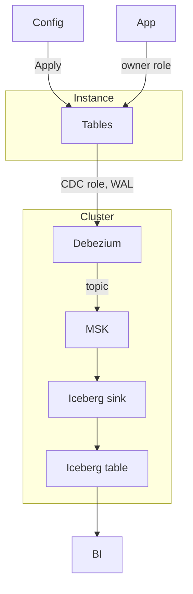

# Relay

PaaS CLI. Commit a [Config](example/example.yaml), run Apply. Relay attaches it to an existing Cluster: Instance, Database, Tables, and a path to Iceberg.

Install
```bash
go install -C cmd/relay .
go test -C cmd/relay ./...
```

Run
```
relay plan example/example.yaml
relay apply example/example.yaml
```

See [CONTEXT.md](CONTEXT.md) for terms.




