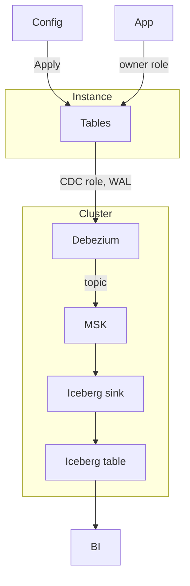

# Relay

PaaS CLI. Commit a [Config](example/example.yaml), run Apply. Relay attaches it to an existing Cluster: Instance, Database, Tables, and a path to Iceberg.

Install
```bash
go install -C cmd/relay .
go test -C cmd/relay ./...
```

Run
```
relay plan example/example.yaml
relay apply example/example.yaml
```

Apply stamps the Database and its owner/CDC roles with `COMMENT ... IS 'relay:{cluster}/{config}'` and refuses objects stamped by another Config. Configs applied before stamping existed: run `relay apply --adopt <config.yaml>` once. `relay plan --adopt` lists what will be claimed. Adopt only claims objects when the Database is already owned by this Config's owner role.

Postgres connections verify the Instance certificate (`sslmode=verify-full`) against the embedded [RDS CA bundle](cmd/relay/rds-global-bundle.pem).

The Config's `cluster` must match the cluster name in `RELAY_MSK_CLUSTER_ARN`.

See [CONTEXT.md](CONTEXT.md) for terms. See [aws-account.md](aws-account.md) for Cluster IAM and account setup.




